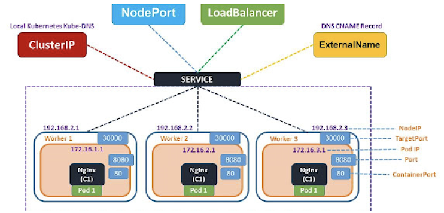
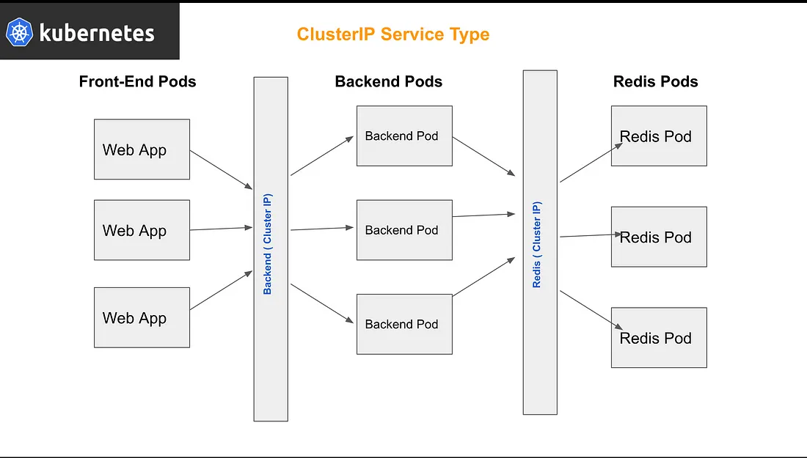
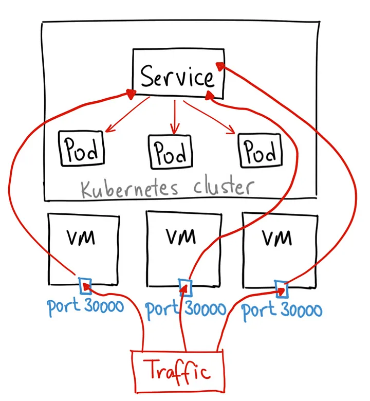
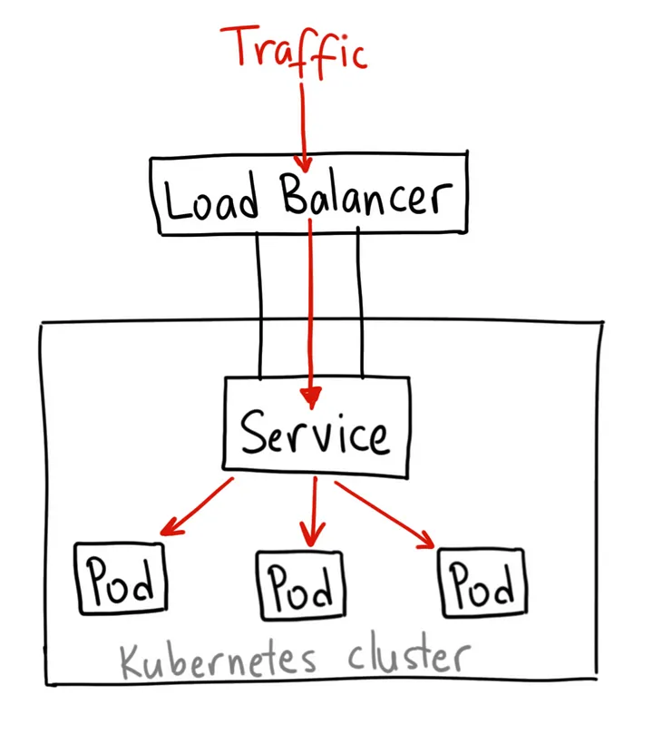
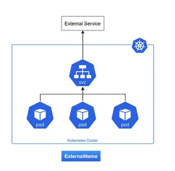
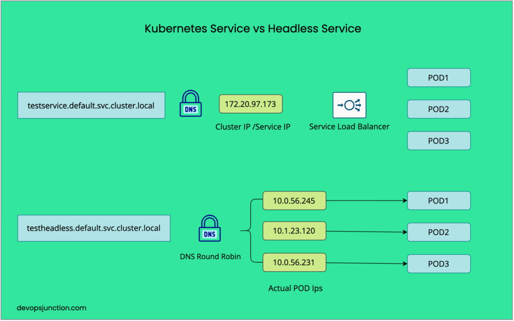
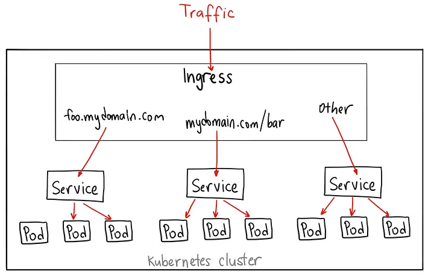
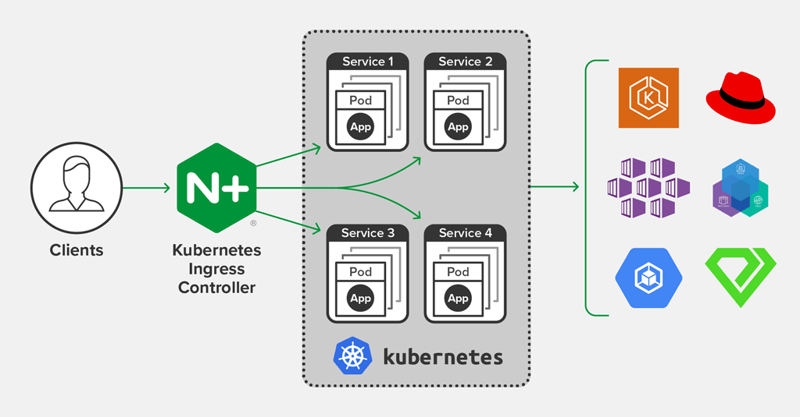

## Services

### ClusterIP Service

Use Case:
- internal communication within cluster
External Access: No
LB : Yes
Internal Communication: Yes
Stable Network Identities: No

### NodePort Service

Use Case:
- external access to services from outside the cluster
External Access: yes
LB: yes
Internal Communication: yes
Stable Network Identities: 

### LoadBalancer Service

Use Case:
- exposing services externally in cloud environments
External Access: yes
LB: yes
Internal Communication: yes
Stable Network Identities: no

### ExternalName Service

Use Case:
- mapping service to an external DNS name
External Access: no
LB: no
Internal Communication: yes
Stable Network Identities: no

### Headless Service

Use Case:
- stateful apps requiring stable identities
External Access: no
LB: no
Internal Communication: yes
Stable Network Identities: yes

### Ingress

NGINX

- independent of your service
- enables routing rules to be consolidated in one place

# K8 Q/A
1. how to start a cluster
minikube start
2. how to destroy a cluster
minikube.stop
3. how to check minikube version
minikube version
4. a. How to make objects defined in YAML file rs.yaml
kubectl create -f rs.yaml
4. b. Create an nginx pod named testnginx
kubectl run test --image nginx
5. List the service accounts
kubectl get sa
6. get the cluster version
kubectl version
7. get the cluster information
kubetl cluster-info
8. list all nodes
kubectl get nodes --all-namespaces
9. list all container iamges from all namespaces
kubectl get pods --all-namespaces -o jsonpath="{.items[*].spec['initContainers', 'containers'][*].image}" |\
tr -s '[[:space:]]' '\n' |\
sort |\
uniq -c
10. list of pods in your current namespace
kubectl get pods
11. list of pods in all namespaces
kubectl get pods --all-namespaces
12. a. get the container names in a pod
kubectl get po <POD_NAME> -o jsonpath="{.spec.containers[*].name}"
12. b. where could you find the names without the json stuff?
kubectl describe pod <pod> --> then look at the containers
13. create a pod from file pod.yaml
kubectl create -f pod.yaml
14. delete a pod using its definition file pod.yaml
kubectl delete -f pod.yaml
15. delete a pod instantly
kubectl delete <pod> --grace-period=0 --force
16. execute commands inside of a container
kubectl exec <pod> -c <container> -- <command>
17. display logs for a pod
kubectl logs -p <pod>
18. display logs for a specific container in a pod
kubectl logs -p <pod> -c <container>
19. get pods name based on specific labels
POD_NAME=$(kubectl get pod \
--no-headers \
-o=custom-columns=NAME:.metadata.name \
-l type=api,service=some-service \
| tail -1)
20. get pods sorted by creation time
kubectl get pods --sort-by='{.metadata.creationTimestamp}'
21. run a long/endless running container
kubectl run test --image ubuntu -- sleep 2000000
22. get a shell access to a container
kubectl -it exec -p <pod> -c <container> -- bash
23. create a new user for the cluster
    1. generate private key
    2. create cert signing request
    3. sign cert with cert authority
    4. generate private key
https://collabnix.com/how-to-create-user-in-kubernetes-cluster-and-give-it-access/
24. expose a replicaset
kubectl expose -rs <replicaset-name> --name=<service-name> --target-port=<PORT> --type
25. create a deployment with a tag
kubectl create deployment demodep --image=nginx/demo:hello
26. check on that deployment
kubectl get deployment demodep
27. check on the pods from that deployment
kubectl get pods --selector app=demo
28. delete the pods from the deployment
kubectl delete pods --selector app=demo
29. delete everything related to that deployment in one step
kubectl delete all --selector app=demo
30. Set up and practice these alias
alias k='kubectl'
alias kg='kubectl get'
alias kgpo='kubectl get pod'
alias kcpyd='kubectl create pod -o yaml --dry-run=client'
alias ksysgpo='kubectl --namespace=kube-system get pod'

alias kd='kubectl delete'
alias kdf='kubectl delete -f'
## for quick deletes you can add --force --grace-period=0  **Not sure if it is a good idea if you are in a production cluster**
alias krmgf='kubectl delete --grace-period 0 --force'
alias kgsvcoyaml='kubectl get service -o=yaml'
alias kgsvcwn='watch kubectl get service --namespace'
alias kgsvcslwn='watch kubectl get service --show-labels --namespace'

#example usage of aliases
krmgf nginx-8jk71    # kill pod nginx-8jk71 using grace period 0 and force

31. Install metric-server using minikube
minikube addons enable metrics-server

-----huh-----
32. use helm to install bitnami sealed secrets controller
helm repo add sealed-secrets https://bitnami-labs.github.io/sealed-secrets
helm repo update
helm install sealed-secrets-controller sealed-secrets/sealed-secrets
33. encrypt a secret in yaml or json 
kubeseal -n my-namespace <.db-creds.yml> db-creds.json
34. apply a secret on the cluster
kubectl apply -f db-creds.json -n my-namespace
35. generate a yaml file(s) using kustomize
kustomize build name_of_application
36. apply customied YAML file on the cluster
kustomize build name_of_application